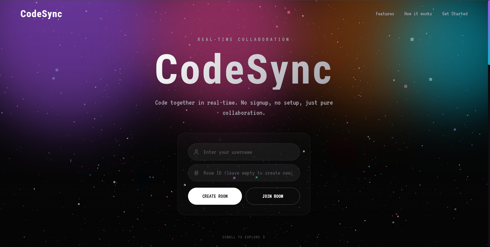
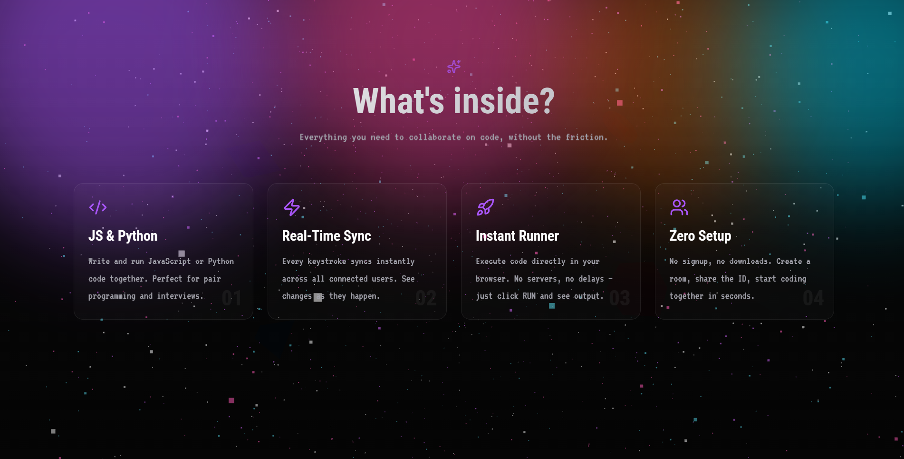
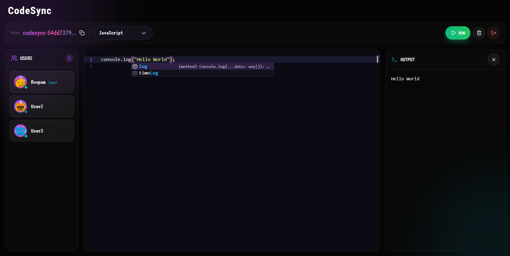
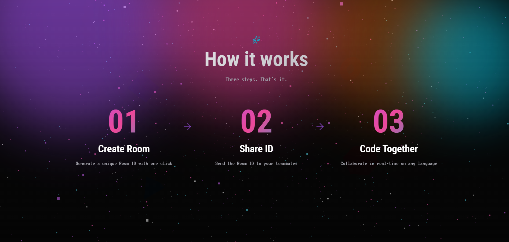

<div align="center">

# 🚀 CodeSync

### Real-Time Collaborative Code Editor

**Code together in real-time. No signup. No setup. Just pure collaboration.**

[](https://codesync-roopam.vercel.app)
[](https://github.com/roopam2005/codesync/stargazers)
[](https://www.linkedin.com/in/roopamviradiya)

[✨ Live Demo](https://codesync-roopam.vercel.app) • [📖 Features](#-features) • [🛠️ Tech Stack](#-tech-stack) • [🚀 Setup](#-getting-started) • [🤝 Collaborate](#-collaborate-with-us) • [👨‍💻 Author](#-author)

---



</div>

## 🌟 About CodeSync

**CodeSync** is a modern, real-time collaborative code editor that lets multiple developers write, edit, and execute code together in shared rooms. Built with cutting-edge tech like React 18, Three.js, and Socket.io — it delivers a seamless VS Code-like experience directly in your browser.

Perfect for **pair programming**, **technical interviews**, **teaching sessions**, **code reviews**, and **remote collaboration**.

> 🎯 **No signup. No downloads. No database. Just share a Room ID and start coding.**

---

## 🚀 Live Demo

**🔗 Try it now:** [https://codesync-roopam.vercel.app](https://codesync-roopam.vercel.app)

Open two browser windows, create a room in one, join with the Room ID in the other, and watch the magic happen! ✨

---

## ✨ Features

<div align="center">



</div>

### 🎨 Core Features

- ⚡ **Real-Time Code Sync** — Every keystroke instantly syncs across all connected users
- 🌍 **Multi-User Rooms** — Unlimited users can join the same coding room
- 💻 **Monaco Editor** — Same editor that powers VS Code (with custom aurora theme)
- 🐍 **JavaScript & Python Support** — Run code directly in your browser
- 🚀 **Instant Code Execution** — No servers, no delays — powered by Pyodide (WebAssembly)
- 🎯 **Zero Setup** — No accounts, no configuration, no installations
- 🎨 **Beautiful UI** — Aurora-themed dark UI with 3D Three.js backgrounds
- 📱 **Responsive Design** — Works on desktop, tablet, and mobile
- 🔔 **Live Notifications** — See when users join, leave, or execute code
- 🔄 **Language Sync** — Language changes sync across all users in real-time
- 📋 **One-Click Copy** — Copy Room ID with a single click
- 🤖 **Unique Avatars** — Auto-generated bot avatars for each user

---

## 🎬 See It In Action

### 💻 The Editor



### 📋 How It Works



---

## 🛠️ Tech Stack

### Frontend

| Technology | Purpose |
|------------|---------|
| ⚛️ **React 18** | UI Library |
| ⚡ **Vite** | Lightning-fast build tool |
| 🎨 **Tailwind CSS** | Utility-first styling |
| 🌌 **Three.js** | 3D animated backgrounds |
| 📝 **Monaco Editor** | VS Code editor in browser |
| 🐍 **Pyodide** | Python via WebAssembly |
| 🔌 **Socket.io Client** | Real-time WebSocket connection |
| 🐻 **Zustand** | Lightweight state management |
| 🎭 **Framer Motion** | Smooth animations |
| 🎯 **Lucide React** | Beautiful icons |

### Backend

| Technology | Purpose |
|------------|---------|
| 🟢 **Node.js** | JavaScript runtime |
| 🚂 **Express** | Web framework |
| 🔌 **Socket.io** | Real-time bidirectional communication |
| 💾 **In-Memory Store** | Zero database, blazing fast |

### Design & Fonts

- 🔤 **VT323** — Retro pixel font (primary)
- 🔤 **Roboto Condensed** — Modern condensed font (secondary)
- 🎨 **Aurora Color Palette** — Purple, Magenta, Cyan, Orange

### Deployment

- 🚀 **Vercel** — Frontend hosting (free)
- 🎨 **Render** — Backend hosting (free)

---

## 🎯 Use Cases

- 👥 **Pair Programming** — Code together in real-time from anywhere
- 📚 **Teaching & Tutoring** — Explain concepts live with shared code
- 💼 **Technical Interviews** — Conduct coding interviews remotely
- 🔍 **Code Reviews** — Review and edit code collaboratively
- 🎓 **Learning Sessions** — Study with friends or study groups
- 🚀 **Hackathons** — Rapid prototyping with your team

---

## 🚀 Getting Started

### Prerequisites

- Node.js 18+ ([Download](https://nodejs.org/))
- npm or yarn
- Git

### Installation

**1. Clone the repository**

```bash
git clone https://github.com/roopam2005/codesync.git
cd codesync
```

**2. Setup Backend**

```bash
cd server
npm install
```

Create `.env` file in `server/` folder:

```env
PORT=5000
CLIENT_URL=http://localhost:5173
NODE_ENV=development
```

**3. Setup Frontend**

```bash
cd ../client
npm install
```

Create `.env` file in `client/` folder:

```env
VITE_BACKEND_URL=http://localhost:5000
```

**4. Run the Application**

**Terminal 1** (Backend):

```bash
cd server
npm run dev
```

**Terminal 2** (Frontend):

```bash
cd client
npm run dev
```

**5. Open in Browser**

Visit [http://localhost:5173](http://localhost:5173)

---

## 📖 How to Use

1. **Enter your username** on the home page
2. **Click "CREATE ROOM"** to generate a unique Room ID
3. **Share the Room ID** with your teammates
4. **They join** using the same Room ID
5. **Start coding together** — everything syncs in real-time!

Choose between JavaScript or Python, write your code, click **RUN**, and see the output on everyone's screen simultaneously.

---

## 🎨 Design Philosophy

CodeSync follows modern design principles inspired by the best developer tools:

- 🌙 **Dark Mode First** — Easy on the eyes for long coding sessions
- 🌌 **Aurora Aesthetics** — Vibrant gradients inspired by northern lights
- 💎 **Glassmorphism** — Modern frosted glass UI elements
- 🎭 **Smooth Animations** — Every interaction feels alive
- 🎯 **Minimal Distractions** — Focus on the code, not the UI

---

## 🗂️ Project Structure

```
codesync/
├── client/                    # React frontend (Vite)
│   ├── src/
│   │   ├── components/       # Reusable UI components
│   │   │   ├── editor/       # Editor-related components
│   │   │   ├── room/         # Room/user components
│   │   │   └── ui/           # Base UI (buttons, cards, etc.)
│   │   ├── pages/            # Route pages (Home, Editor, 404)
│   │   ├── hooks/            # Custom React hooks
│   │   ├── store/            # Zustand state stores
│   │   ├── services/         # API service layer
│   │   ├── socket/           # Socket.io client setup
│   │   ├── three/            # Three.js 3D scenes
│   │   ├── utils/            # Helper functions
│   │   └── main.jsx          # Entry point
│   └── package.json
│
├── server/                    # Node.js backend
│   ├── src/
│   │   ├── config/           # CORS & configuration
│   │   ├── socket/           # Socket.io event handlers
│   │   ├── store/            # In-memory data store
│   │   ├── routes/           # REST API routes
│   │   ├── middleware/       # Express middleware
│   │   └── utils/            # Server utilities
│   ├── main.js               # Server entry point
│   └── package.json
│
├── Screenshots/               # Project screenshots
└── README.md
```

---

## 🎥 Key Features Breakdown

### 🔄 Real-Time Synchronization

Every keystroke is broadcasted to all users in the room via WebSockets (Socket.io). No polling, no delays — pure real-time collaboration.

### 🐍 Python in the Browser (Pyodide)

Python code runs directly in your browser using **Pyodide** (Python compiled to WebAssembly). No backend servers, no rate limits, no signup — just unlimited Python execution.

### ⚡ Local JavaScript Execution

JavaScript runs locally using a sandboxed `Function` constructor with captured console output. Instant execution, unlimited runs.

### 🎨 Three.js Aurora Background

The stunning aurora background is powered by Three.js with:

- 3000+ animated particles in a 3D space
- Floating geometric shapes (octahedron, torus, icosahedron)
- Mouse-follow parallax effect
- Optimized rendering with `pointsMaterial`

### 🎭 Custom Monaco Theme

The editor uses a custom "codesync-dark" theme inspired by Dracula:

- Purple cursor and active line numbers
- Pink keywords, yellow strings, green functions
- Aurora-themed selection colors
- Bracket pair colorization

---

## 🚧 Roadmap

Future features being considered:

- [ ] Live chat between users in a room
- [ ] Cursor position sync (see where others are typing)
- [ ] User roles (host, editor, viewer)
- [ ] Multiple file support
- [ ] GitHub OAuth login
- [ ] Code snippets library
- [ ] Export code as .zip
- [ ] More languages (Rust, Go via WebAssembly)
- [ ] Voice chat integration
- [ ] Screen sharing
- [ ] Save code snapshots
- [ ] Custom editor themes

---

## 🤝 Collaborate With Us

**CodeSync is open for collaboration!** Whether you're a beginner or an experienced developer, we welcome contributions of all kinds.

### 💡 Ways to Contribute

- 🐛 **Report Bugs** — Found something broken? Open an issue!
- ✨ **Suggest Features** — Have a great idea? Share it with us!
- 📝 **Improve Documentation** — Help make our docs even better
- 🎨 **Design Improvements** — Suggest UI/UX enhancements
- 💻 **Write Code** — Pick any item from the roadmap and start building
- 🌍 **Translations** — Help translate CodeSync to your language
- ⭐ **Spread the Word** — Star the repo and share with others

### 🛠️ How to Contribute

1. **Fork the repository** — Click the "Fork" button at the top
2. **Clone your fork** locally:

   ```bash
   git clone https://github.com/YOUR_USERNAME/codesync.git
   cd codesync
   ```

3. **Create a new branch** for your feature:

   ```bash
   git checkout -b feature/your-amazing-feature
   ```

4. **Make your changes** and commit with clear messages:

   ```bash
   git commit -m "Add: your amazing feature description"
   ```

5. **Push to your fork**:

   ```bash
   git push origin feature/your-amazing-feature
   ```

6. **Open a Pull Request** — Describe what you built and why

### 📋 Contribution Guidelines

- ✅ Follow the existing code style and structure
- ✅ Write clear, descriptive commit messages
- ✅ Test your changes locally before submitting
- ✅ Update documentation if you add new features
- ✅ Be respectful and constructive in discussions
- ✅ One feature per pull request (keep it focused)

### 🎯 Good First Issues

New to open source? Look for issues tagged with:

- `good first issue` — Perfect for beginners
- `help wanted` — We need your expertise!
- `documentation` — Improve our docs
- `enhancement` — Small improvements

### 💬 Get in Touch

Want to discuss ideas before contributing? Reach out:

- 📧 Open a **Discussion** on GitHub
- 💼 Message on [LinkedIn](https://www.linkedin.com/in/roopamviradiya)
- 🐛 Create an **Issue** for bugs or feature requests

**Let's build something amazing together!** 🚀

---

## 🐛 Known Issues

- First Python execution takes ~10 seconds to load Pyodide runtime (subsequent runs are instant)
- Render free tier backend sleeps after 15 min inactivity (first request wakes it up in ~30s)
- Best experienced on desktop/tablet (mobile shows a friendly warning)

---

## ⭐ Support the Project

If you find CodeSync useful, here's how you can support:

- ⭐ **Star this repository** — Helps others discover the project
- 🍴 **Fork and contribute** — Your code makes it better
- 🐛 **Report issues** — Help us squash bugs
- 📢 **Share it** — Tell your developer friends
- 💬 **Give feedback** — Tell us what you love or want improved

**Share it with your network:**

- 🐦 [Share on Twitter](https://twitter.com/intent/tweet?text=Check%20out%20CodeSync%20-%20Real-time%20collaborative%20code%20editor!&url=https://codesync-roopam.vercel.app)
- 💼 [Share on LinkedIn](https://www.linkedin.com/sharing/share-offsite/?url=https://codesync-roopam.vercel.app)

---

## 👨‍💻 Author

<div align="center">

### **Roopam Viradiya**

Full-Stack Developer • Building modern web experiences

[](https://www.linkedin.com/in/roopamviradiya)
[](https://github.com/roopam2005)

</div>

---

## 🙏 Acknowledgments

Built with amazing free tools:

- [React](https://react.dev/) — The library for web UIs
- [Vite](https://vitejs.dev/) — Next-gen frontend tooling
- [Three.js](https://threejs.org/) — 3D graphics for the web
- [Monaco Editor](https://microsoft.github.io/monaco-editor/) — VS Code's editor
- [Pyodide](https://pyodide.org/) — Python in the browser
- [Socket.io](https://socket.io/) — Real-time WebSockets
- [Tailwind CSS](https://tailwindcss.com/) — Utility-first CSS
- [DiceBear](https://www.dicebear.com/) — Avatar library
- [Lucide Icons](https://lucide.dev/) — Beautiful icons
- [Vercel](https://vercel.com/) — Frontend hosting
- [Render](https://render.com/) — Backend hosting

---

<div align="center">

### 💫 Star this repo if you found it useful!

**Made with ♥ using React, Three.js & Socket.io**

*© 2026 CodeSync • Free Forever*

</div>